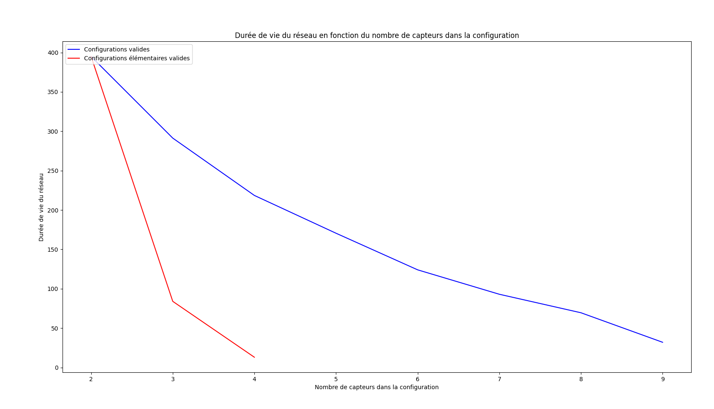

# Rapport de projet 

**Loïc BERTRAND - S4A2**

## Préface

Le projet est intégralement écrit en python 3.8 et il utilise les bibliothèques suivantes :

* prettytable
* glpk
* pylab-sdk
* numpy
* matplotlib
* progress

À priori, sous Linux, il suffit d'exécuter le makefile comme expliqué ci-dessous afin d'installer les bibliothèques python et lancer le programme.

Il faut néanmoins que le gestionnaire de paquet pip pour python 3 soit installé sur votre machine.

### Installer le projet


```shell
make install
```

### Lancer le programme
```shell
make run
```

### Utiliser le programme

> La navigation se fait via la saisie de chiffres et via la touche "Entrer"

#### Situations sous format fichier

Vous pouvez ajouter ou supprimer des situations dans le répertoire "donnee" du projet afin de les charger ensuite via le programme.

Si vous sauvegardez une situation depuis le programme, elle sera écrite dans un nouveau fichier dans le répertoire "donnee".

#### Premier lancement

Le menu principal vous permet de choisir entre la création manuelle d'une situation ou son chargement depuis un fichier.

Une situation créée ou chargée, trois options s'offrent à vous.

##### Option 1: Traiter la situation

Il s'agit de la génération des configurations élémentaires et de la résolution de la situation via le solveur glpk.

##### Option 2: Examiner l'influence du nombre et du type des configurations

La sélection de cette option vous tracera la courbe de la durée de vie du réseau en fonction du nombre de capteurs dans la configuration.

##### Option 3 : Sauvegarder la situation

Ceci crée un nouveau fichier dans le répertoire "donnee" du projet dans lequel sera décrit la situation. Ce fichier pourra ensuite être rechargé pour une utilisation ultérieure.


## Partie 1 : Manipulation des données

J’ai choisi Python 3.8 pour traiter ce projet. Afin de modéliser les données, j'ai créé les objets «Capteur» et «Situation». L'objet «Capteur» contient les attributs «duree_de_vie» et «zones_couvertes». L'attribut «duree_de_vie» est un entier égal à la durée de vie du capteur. L'attribut «zones_couvertes» est une liste d'entiers qui correspondent aux indices des zones couvertes. Une situation contient les attributs «capteurs» et «zones». L'attribut capteurs est une liste d'objets «Capteur». L'attribut «zones» est une liste d'entiers qui correspondent aux indices de toutes les zones de la situation. Les données d'une situation peuvent être instanciées par la lecture d'un fichier ou par une saisie manuelle.

### Chargement à partir d'un  fichier

```python
    def lire_depuis_fichier(self, chemin_absolu_fichier):
        # ouvrir le fichier en mode lecture
        fichier = open(chemin_absolu_fichier, "r")
        # lire nombre de capteurs
        ligne = fichier.readline()
        nombre_capteurs = int(re.search(r'\d*', ligne).group())
        # lire nombre de zones
        ligne = fichier.readline()
        nombre_zones = int(re.search(r'\d*', ligne).group())
        self.__zones = [i for i in range(1, nombre_zones + 1)]
        # lire les durées de vie des capteurs
        ligne = fichier.readline()
        durees_de_vie = [int(i) for i in re.findall(r'\d', ligne)]
        # lire les zones couvertes par les capteurs
        ligne = fichier.readline()
        for i in range(nombre_capteurs):
            if ligne == "":
                return -1
            zones_couvertes = [int(i) for i in re.findall(r'\d', ligne)]
            try:
                self.__capteurs.append(Capteur.Capteur(durees_de_vie[i], zones_couvertes))
            except IndexError:
                return -1
            ligne = fichier.readline()
        # fermer le fichier
        fichier.close()
        return 0
```

### Saisie manuelle

J'ai créé un objet «Terminal» afin d'implémenter une seule fois toutes les opérations de contrôle de saisie et d'affichage. 

```python
 	def saisir_manuellement(self, terminal):
        terminal.set_partie("Saisie manuelle d'une situation")
        # Saisir nombre de capteurs
        nombre_capteurs = terminal.saisir(("nombre de capteurs", "entier+0"))
        # Saisir nombre de zones
        nombre_zones = terminal.saisir(("nombre de zones", "entier+0"))
        self.__zones = [i for i in range(1, nombre_zones + 1)]
        # Pour chaque capteur
        for i in range(nombre_capteurs):
            terminal.set_activite("Capteur n° " + str(i + 1))
            # Saisir duree_de_vie
            duree_de_vie = terminal.saisir(("durée de vie", "entier+0"))
            # Saisir zones couvertes
            zone_couvertes = list()
            while True:
                if set(zone_couvertes) == set(self.__zones):
                    break
                zone_a_couvrir = terminal.saisir(("Zones non couvertes: " + str(
                    [i for i in self.__zones if i not in zone_couvertes]) + "\n" + "Zones couvertes: " + str(
                    zone_couvertes) + "\n" + "\n> Saisir une zone à couvrir (q pour finir)", "entier+0|q"))
                if zone_a_couvrir == "q":
                    break
                if zone_a_couvrir not in [i for i in self.__zones if i not in zone_couvertes]:
                    continue
                zone_couvertes.append(zone_a_couvrir)
                continue
            # ajouter capteur
            self.__capteurs.append(Capteur.Capteur(duree_de_vie, zone_couvertes))
        terminal.imprimer_message("Saisie de la situation complétée avec succès !", 2)
```

## Partie 2 : construction de configurations élémentaires

L'objet situation contient des méthodes qui permettent de générer la liste de toutes les configurations élémentaires valides. Dans un premier temps j'ai choisi de générer une liste de toutes les configurations. Dans un deuxième temps, je génère une liste des configurations valides. Dans un troisième temps, je génère une liste des configurations élémentaires.

### Génération de toutes les configurations

```python
	@staticmethod
    def generer_toutes_les_configurations(elements):
        toutes_les_configurations = []
        for i in range(2 ** len(elements)):
            configuration = []
            for j in range(len(elements)):
                if (i & (1 << j)) != 0:
                    configuration.append(elements[j])
            if configuration not in toutes_les_configurations:
                toutes_les_configurations.append(configuration)
        return toutes_les_configurations
```

### Génération des configurations valides

```python
	def __generer_configurations_valides(self, configurations):
        configurations_valides = []
        for configuration in configurations:
            if self.__est_configuration_valide(configuration):
                configurations_valides.append(configuration)
        return configurations_valides
    
    def __est_configuration_valide(self, configuration):
        zones_couvertes = []
        for indice_capteur in configuration:
            for zone_couverte in self.__capteurs[indice_capteur].get_zone_couvertes():
                if zone_couverte not in zones_couvertes:
                    zones_couvertes.append(zone_couverte)
                if set(zones_couvertes) == set(self.__zones):
                    return True
        return False
```


### Génération des configurations élémentaires

```python
    def __generer_configurations_elementaires(self, configurations):
        configurations_elementaires = []
        for configuration in configurations:
            compteur_configurations_valides = 0
            for sous_configuration in self.__generer_toutes_les_configurations(configuration):
                if self.__est_configuration_valide(sous_configuration):
                    compteur_configurations_valides += 1
            if compteur_configurations_valides == 1:
                configurations_elementaires.append(configuration)
        return configurations_elementaires
```


### Partie 3 : écriture et résolution du programme linéaire

```python
probleme = glpk.LPX()
        probleme.name = 'Maximiser la durée de vie du réseau'
        probleme.obj.maximize = True
        probleme.rows.add(len(self.__capteurs))  # Ajouter autant de contraintes que de capteurs
        for ligne in probleme.rows:  # Pour chaque contrainte liée à un capteur
            ligne.name = "Contrainte des configurations contenant le capteur S" + str(
                ligne.index + 1)  # Nommer la contrainte
            probleme.rows[ligne.index].bounds = None, float(
                self.__capteurs[ligne.index].get_duree_de_vie())  # Set bound -inf < C1 <= durée de vie du capteur
        probleme.cols.add(
            len(configurations_valides_elementaires))  # Ajouter autant de colonnes (variables que de configurations
        for colonne in probleme.cols:  # Pour toutes les colonnes
            colonne.name = 'tu%d' % (colonne.index+1)  # Les nommer tu1, tu2, ..., tuN
            colonne.bounds = 0.0, None  # La durée ne peut pas être négative
        probleme.obj[:] = [1.0] * len(
            configurations_valides_elementaires)  # Initialiser tous les coefficients de la fonction objectif à 1.0
        # définir matrice des coefficients pour capteur pour chaque configuration
        matrice_coefficients = []
        for indice_capteur in range(len(self.__capteurs)):  # pour chaque capteur
            for configuration in configurations_valides_elementaires:  # pour chaque configuration
                if indice_capteur in configuration:
                    matrice_coefficients.append(1.0)  # si le capteur est présent, alors son coefficient vaut 1
                else:
                    matrice_coefficients.append(0.0)  # si le capteur est absent, alors son coefficient vaut 0
        probleme.matrix = matrice_coefficients  # affecter la matrice des coeffecients au problème
        probleme.simplex()  # résoudre le problème avec la méthode du simplex
        duree_de_vie_optimale = probleme.obj.value  # récupérer la durée de vie optimale
```


### Partie 4 : analyse des résultats

J'ai choisi la situation décrite ci-dessous afin d'examiner l'influence du nombre et du type des configurations choisies sur la durée de vie du réseau.

```
10
10
13 55 166 71 72 144 192 52 90 19
1 4 2
9 8 5 10 4
3 5 2 9 8 7 6 4 1
3 6 8 4 1
8 2 7 5 6 10 4
9 8 2 10 1 6 4 5
6 7 3 4 9 1 10 8 2
5 6 7
7 9 3 4 5 1 6
6 5 2 1 8 3 7
```

À l'aide du solveur glpk et de la bibliothèque mathématiques matplotlib de python, j'ai calculé et tracé la courbe de la durée de vie du réseau en fonction du nombre de capteurs dans la configuration.



Nous pouvons voir que la durée de vie maximale du réseau s'obtient pour un minimum de capteurs dans la configuration.